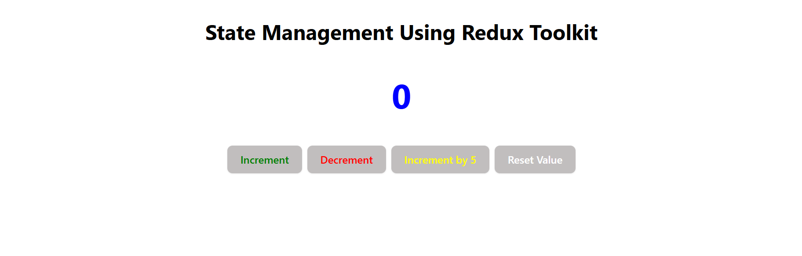
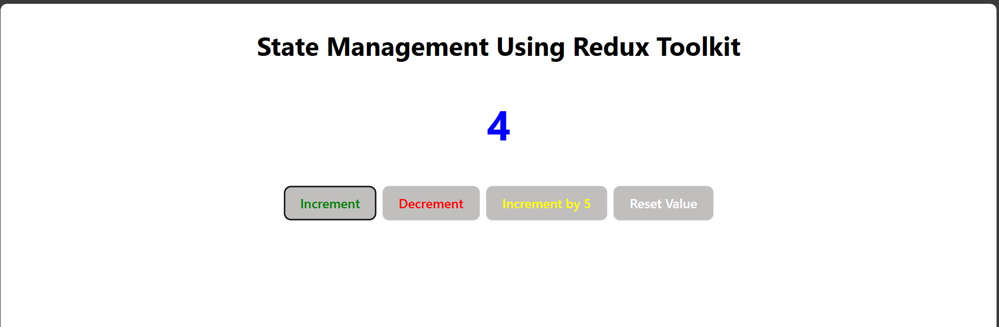
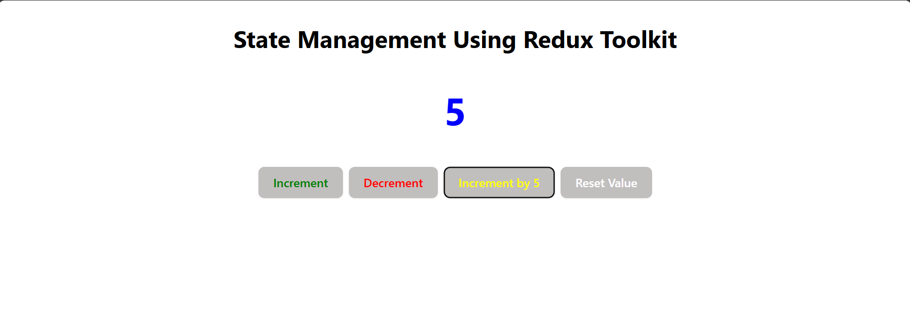
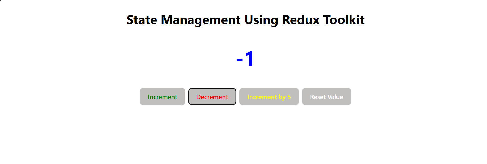
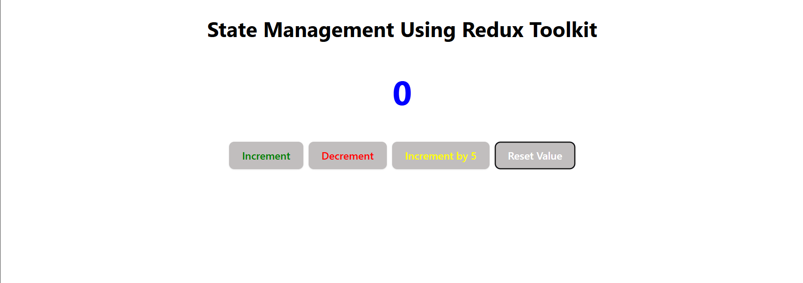

# Counter State Management Task

This project demonstrates basic state management functionality in React with a counter. The counter supports the following operations:

## Features

1. **Increment**: Increase the counter value by 1.
2. **Decrement**: Decrease the counter value by 1.
3. **Multiply by 5**: Multiply the counter value by 5.
4. **Reset**: Reset the counter value to 0.

## Screenshots 


_**Home Page**: View of the main screen of the counter app._


_**Category View**: A single increment in the app._


_**Home Page**: View of the increment by 5 screen._


_**Home Page**: View of the decrement in the counter app._


_**Home Page**: Reset the counter app to initial state which is 0._

## Technologies Used

- **React.js**: Frontend framework for building the UI.
- **State Management**: Managed using React's `useState` hook.

## How to Run the Project

1. Clone this repository:
   ```bash
   git clone https://github.com/your-username/counter-state-management.git
